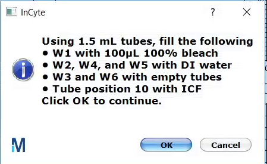
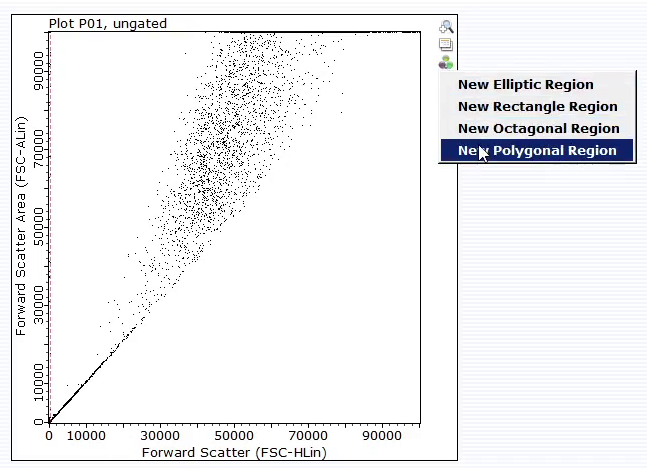

## Preparation
1. Pipette your samples in an appropriate scheme on a well plate

## Acquisition

2. Start the `guavaSoft` software on the attached PC
3. Select `InCyte`
4. In the top left, under the `Acquire` menu, click `Edit
   Worklist`
   { height=24px }\

5. Populate the plate map with your sample information by clicking one or
   more wells and checking off `Acquire this sample` and entering the `Sample
   ID`. Enter the number of `Events to Acquire`
6. On the right, click `Run Worklist`
7. Click `Adjust Settings`
8. Place your plate in the ejected tray
9. Follow the on-screen instructions for the eppendorf tube contents

    {height=120px }\

    then click `OK`
10. Another `Adjust Settings` panel will appear. Click a well to acquire and
    click `OK`. Adjust settings as necessary
11. Click `Next Step` to proceed to the next well
    { height=24px }\
    and `Resume Worklist`

## Analysis

12. Click `Analyse`
13. Select one of the samples
14. Set the event gate by clicking on the ` New Region` button on the plot and
    selecting the gate shape

    { height=240px }\
15. Apply the gate to plot 2 by clicking this button over there
    { height=24px }\ and select either dimension
16. Click `New Region` on plot 2 and draw a gate around the group of interest
17. Apply the gate to plot 3 to gate the histogram

For more information see the full instruction manuals at

[https://www.luminexcorp.com/?wpdmdl=41831](https://www.luminexcorp.com/?wpdmdl=41831)

and

[https://www.luminexcorp.com/?wpdmdl=41833](https://www.luminexcorp.com/?wpdmdl=41833)
