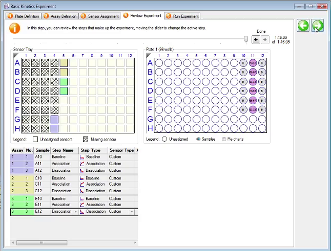

# Basic Kinetics Experiment
## Preparation
1. Pipette phosphate-buffered saline --- or whichever buffer system in which
   your proteins are well-behaved --- into a 96-well plate and place a sensor
   array on top of it to prehydrate the sensors
2. Pipette your samples in an appropriate scheme on another 96-well plate,
   including blank wells for baseline acquisition and dissociation measurements
3. Open the Octet cabinet and place the sensor array on the tray on the left and
   the well plate on the tray on the right, aligning the A1 well to the top
   right corner
4. Close the cabinet

## Acquisition

5. On the attached PC, start the Octet Data Acquisition Software
6. Define buffers and samples in the `Plate Definition` window in the
   acquisition software by dragging the mouse to highlight the desired wells.
   Right click to specify wells as sample, reference, control, buffer,
   activation, etc.

   { height=240px }\

7. Enter your Sample IDs, the concentrations, and molecular weights for your
   samples in the plate table
8. In the `Assay Definition` tab, select your buffer wells and specify the assay
   type as `Baseline`, and specify the time (in seconds) and shake speed (in
   rpm). Assay steps are run in pairs so you will be defining two steps at
   a time
9. Double click an item in the `Step Data List` to add it to the `Assay Steps
   List`
10. Select your protein wells, click `Add`, and specify them as `Association`
   assays
11. Select the next buffer wells, click `Add`, and specify them as `Dissociation`
   assays
12. Select the assay steps under `Assay Steps List` and use the `Replicate`
   button to repeat experiments with different wells. Note that the total
   experiment time will update in the bottom right of the panel
13. Change the `Sensor Type` in each assay step to the sensor being used

    { height=240px }\

14. Select the `Sensor Assignment` tab. Under the `Sensory Tray` panel, drag the
    mouse to select your sensors and right click to assign them

    { height=240px }\

15. In the `Run Experiment` tab, specify where to save you data. You can uncheck
    `Delayed Experiment Start` if your sensors are already prehydrated or adjust
    the delay time
16. Click `Go` to begin the experiment

For more information see the data analysis manual at

[http://www.biophysics.bioc.cam.ac.uk/wp-content/uploads/2019/10/Data-Analysis-Octet.pdf](http://www.biophysics.bioc.cam.ac.uk/wp-content/uploads/2019/10/Data-Analysis-Octet.pdf)
